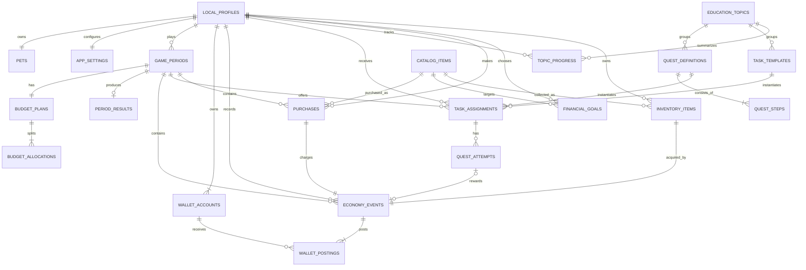

# ER-модель локальной базы данных приложения Грошик

Версия модели: 1.0. Целевая БД: SQLite на устройстве через Drift или эквивалентный слой доступа. Основной артефакт для построения визуальной ER-диаграммы — `groshik-er.dbml`: его можно импортировать в dbdiagram.io.

## Решение по архитектуре

Раздел «Бд» файла «Лучше Црезвоньте Толу 2026» предлагает PostgreSQL/Supabase, `auth.users`, роли родителя и ребёнка и серверную аналитику. Для конкурсного MVP эта часть не принимается буквально, потому что противоречит более приоритетному ТЗ:

- обязательный сценарий работает без регистрации и без сбора ПДн;
- локальный игровой профиль хранится только на устройстве;
- серверная часть и ИИ не обязательны;
- основной игровой цикл должен работать без постоянного Интернета;
- локальное состояние разрешено хранить в SQLite/Room или эквиваленте;
- взрослый может сбросить и удалить профиль локально.

QA-сессия дополнительно подтверждает, что задания допустимо хранить в отдельном конфиг-файле внутри APK, деморежим отличается только отсутствием ожидания, а финансовые правила в нём должны оставаться настоящими.

Поэтому схема описывает локальную реляционную БД. Контентные таблицы могут заполняться из версионированного JSON при установке или обновлении приложения. Облачная синхронизация, аккаунты и ML-аналитика находятся за границами MVP.

## Чего в БД намеренно нет

В схеме отсутствуют:

- ФИО и реальное имя ребёнка или родителя;
- возраст, дата рождения, пол, школа и класс;
- телефон, e-mail, адрес и геолокация;
- фото, голос, контакты и сведения о семье;
- рекламный, аппаратный или облачный идентификатор устройства;
- банковские данные, реальные доходы и семейный бюджет;
- `auth.users`, учётные записи родителя и ребёнка;
- удалённая поведенческая аналитика и выгрузка журналов в ML-сервис.

`pet_name` — имя виртуального питомца. В интерфейсе поле нужно подписать именно так и не предлагать вводить имя ребёнка. Родительские задания выбираются из `task_templates`; свободный текст в базовой схеме отсутствует, чтобы случайно не сохранить ПДн.

## Обзор связей

## Группы сущностей

| Группа | Таблицы | Что поддерживает в wireflow |
|---|---|---|
| Профиль и питомец | `local_profiles`, `pets`, `app_settings` | Создание питомца, состояние, три стадии, настройки и локальный взрослый барьер |
| Игровой период | `game_periods`, `budget_plans`, `budget_allocations`, `period_results` | План до расходов, три обязательные категории, План/Факт, деморежим, история периода |
| Игровая экономика | `wallet_accounts`, `economy_events`, `wallet_postings` | Доступный баланс, накопления, объяснимые начисления, атомарные списания и защита от повторного клика |
| Образовательный контент | `education_topics`, `quest_definitions`, `quest_steps`, `task_templates` | Пять тем Тридевятого царства, расширяемые задания и безопасные шаблоны взрослого |
| Прохождение | `task_assignments`, `quest_attempts`, `topic_progress` | Доступные и завершённые задания, ошибочная ветка, восстановление, награда один раз, общий прогресс |
| Покупки и цели | `catalog_items`, `purchases`, `financial_goals`, `inventory_items` | Еда и игрушки, витрина артефактов, выбор цели, копилка, получение артефакта и открытие локации |

## Логические и физические типы

DBML показывает логические типы, чтобы диаграмма оставалась понятной. В SQLite они реализуются так:

| Логический тип DBML | SQLite | Правило |
|---|---|---|
| `uuid` | `TEXT` | UUID v4, генерируется локально |
| `timestamp` | `TEXT` | UTC ISO-8601, например `2026-09-16T17:30:00Z` |
| `boolean` | `INTEGER` | только `0` или `1` |
| `Enum` | `TEXT` | `CHECK(value IN (...))` |
| `smallint`, `int` | `INTEGER` | дополнительные `CHECK` для диапазонов и неотрицательных сумм |
| `json` | `TEXT` | `CHECK(json_valid(value))` при наличии JSON1 |
| `varchar(n)` | `TEXT` | `CHECK(length(value) <= n)` для пользовательских полей |

Все денежные значения — целые неотрицательные игровые монеты. `REAL` и значения с плавающей точкой не используются.

## Ключевые ограничения, которые нужно реализовать в SQLite

DBML показывает структуру, но часть бизнес-ограничений следует закрепить индексами, триггерами и транзакциями:

1. Только один `ACTIVE` период на профиль: partial unique index по `game_periods(profile_id) WHERE status = 'ACTIVE'`.
2. Только одна `ACTIVE` финансовая цель на профиль: partial unique index по `financial_goals(profile_id) WHERE status = 'ACTIVE'`.
3. Подтверждённый план неизменяем. Триггеры запрещают `UPDATE` и `DELETE` `budget_plans`/`budget_allocations`, если статус `CONFIRMED`.
4. У подтверждённого плана должны существовать ровно три строки `NEED`, `WANT`, `SAVINGS`; их сумма вместе с `unallocated_amount` равна `available_amount`.
5. Баланс обоих кошельков не бывает отрицательным. Финансовое событие, его проводки и обновление `current_balance` выполняются в одной SQLite-транзакции.
6. `idempotency_key` уникален. Повторный клик возвращает результат уже выполненного события и не начисляет/не списывает монеты повторно.
7. Награда за попытку выдаётся один раз: `quest_attempts.reward_event_id` уникален и заполняется только для разрешённого успешного результата.
8. Покупка создаётся только после проверки остатка; `purchases.economy_event_id` — уникальная связь 1:1 со списанием.
9. `task_assignments` содержит ровно один источник контента: `quest_id` для системного задания или `task_template_id` для локального задания взрослого.
10. Все строки профиля удаляются одной локальной транзакцией `DELETE local_profiles ... ON DELETE CASCADE`; справочники контента сохраняются. Сброс тестового профиля затем создаёт исходный набор заново.

## Как основные действия записываются в БД

| Действие | Записи |
|---|---|
| Первый запуск | `local_profiles`, `pets`, `app_settings`, два `wallet_accounts` |
| Стартовый бюджет | `economy_events(START_GRANT)` и положительная проводка в `SPENDABLE` |
| Утверждение плана | `budget_plans(CONFIRMED)` и три `budget_allocations` |
| Успешный квест | `quest_attempts(SUCCESS)`, `economy_events(QUEST_REWARD)`, проводка `+` в `SPENDABLE` |
| Ошибка в квесте | `quest_attempts(RECOVERABLE_ERROR)` без денежного события; сохраняется показ объяснения |
| Покупка еды/игрушки | `purchases`, `economy_events(PURCHASE)`, проводка `-` из `SPENDABLE`, снимок изменения питомца |
| Пополнение копилки | одно событие `SAVINGS_DEPOSIT`, две проводки: `-SPENDABLE`, `+SAVINGS` |
| Снятие накоплений | одно событие `SAVINGS_WITHDRAWAL`, две проводки: `-SAVINGS`, `+SPENDABLE` |
| Получение артефакта | `GOAL_REDEMPTION`, проводка `-SAVINGS`, `inventory_items`, цель получает статус `REDEEMED` |
| Конец периода | `period_results`, обновление `pets`, закрытие `game_periods` |
| Следующий демопериод | новый `game_periods` сразу, без ожидания реального времени |

## Что изменено относительно исходного раздела Бд

| Исходная идея | Решение для MVP | Причина |
|---|---|---|
| `profiles` с ролями `parent`/`child` и `auth.users` | один `local_profiles` без роли и аккаунта | ТЗ запрещает обязательную регистрацию и сбор ПДн |
| Supabase/PostgreSQL как основная БД | SQLite/Drift на устройстве | сервер не обязателен, профиль локальный, основной цикл работает офлайн |
| `parent_id`, PIN и отдельный родительский пользователь | локальный `parent_gate` без идентичности родителя | взрослый раздел — режим интерфейса, а не пользовательская учётная запись |
| свободный текст домашнего задания | выбор из `task_templates` | свободный текст может случайно содержать ПДн |
| отправка `transaction_logs` в ML | локальный журнал `economy_events` без экспорта | ИИ не обязателен; поведенческие данные ребёнка не покидают устройство |
| баланс полем профиля | два кошелька и неизменяемые события с проводками | объяснимость, аудит и атомарность переводов между балансом и накоплениями |
| поля удержания/оттока | отсутствуют | не нужны обязательному пользовательскому сценарию и создают лишнее профилирование |

## Граница модели

Схема покрывает конкурсный MVP и текущий wireflow. Она не включает облачную синхронизацию, удалённый кабинет родителя, push-токены, серверную ML-адаптацию и сбор аналитики. Если после MVP появится синхронизация, её следует проектировать отдельным контуром с отдельной правовой оценкой, согласием законного представителя, сроками хранения и удалением данных; текущий локальный UUID нельзя автоматически превращать в облачную личность.

## Источники и приоритет

1. Основной нормативный источник: `6_Департамент_финансов_города_Москвы.pdf`, особенно требования 2.5, 3.1–3.5, 5 и Приложение А.
2. Продуктовый источник: `Лучше_Црезвоньте_Толу_2026.pdf`, раздел «Бд» на страницах PDF 11–13, каталог артефактов и согласованный wireflow v0.2.
3. Дополнительное уточнение: `Город 6 - Вопросы и ответы.pdf`, страницы PDF 4–8 о возрасте, игровом периоде, деморежиме, экономике и хранении заданий.

Если источники расходятся, в этой модели приоритет имеет ТЗ, затем опубликованные ответы заказчика, затем проектные наработки.
